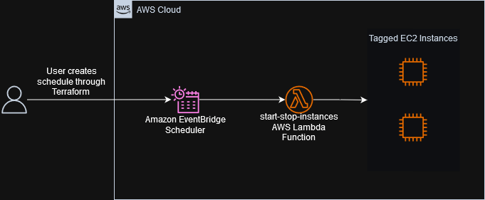

# ec2-scheduler

The AWS Solutions Library maintains the [Instance Scheduler on AWS](https://aws.amazon.com/solutions/implementations/instance-scheduler-on-aws/) that is feature rich allowing cross-account scheduling, works with EC2 and RDS, includes a CLI, integration with SSM and more. This solution is not that. It's built with a subset of features, to work for EC2 instances in a single account. You can define schedules in Terraform and apply them to groups of EC2 instances with the appropriate tags.

## Description

This solutions uses Amazon EventBridge Scheduler to create and run scheduled tasks. The scheduler run at defined times and targets instances through a key/value tag. This triggers a Lambda function which starts or stops the EC2 instances based on the tag defined by the EventBridge Scheduler. Multiple EventBridge Schedulers can be defined by the user to target different times and tags.



## Usage instructions

An example of two schedules are defined in `main.tf` with an abbreviated version below. The `schedule` module depends on the `shared-resources` module which sets up the Lambda function, and IAM roles and policies needed for the solution. Each new schedule can be set by creating a new instance of the `schedule` module as show in the example.

```HCL
module "shared-resources" {
    source = "./modules/shared-resources"
    scheduler_group_name = var.scheduler_group_name
}

module "workday_start" {
    source = "./modules/schedule"
    scheduler_name = "workday-start"
    scheduler_group_name = var.scheduler_group_name
    schedule_expression = "cron(00 9 ? * 2-6 *)"
    scheduler_target_arn = module.shared-resources.start_stop_lambda_function_arn
    scheduler_target_role_arn = module.shared-resources.scheduler_execution_role_arn
    scheduler_target_input = jsonencode({
        start = true
        tag_name = "scheduler"
        tag_value = "dev"
    })
}

module "everyday_stop" {
    source = "./modules/schedule"
    scheduler_name = "everyday-stop"
    scheduler_group_name = var.scheduler_group_name
    schedule_expression = "cron(00 22 * * ? *)"
    scheduler_target_arn = module.shared-resources.start_stop_lambda_function_arn
    scheduler_target_role_arn = module.shared-resources.scheduler_execution_role_arn
    scheduler_target_input = jsonencode({
        start = false
        tag_name = "scheduler"
        tag_value = "dev"
    })
}
```

## Cost

Billable resources in this solution include [Amazon EventBridge Scheduler](https://aws.amazon.com/eventbridge/pricing/) and [AWS Lambda function](https://aws.amazon.com/lambda/pricing/) invocations. Both of which are covered under the "Always Free Tier". Please visit the relevant product pricing pages for more details.